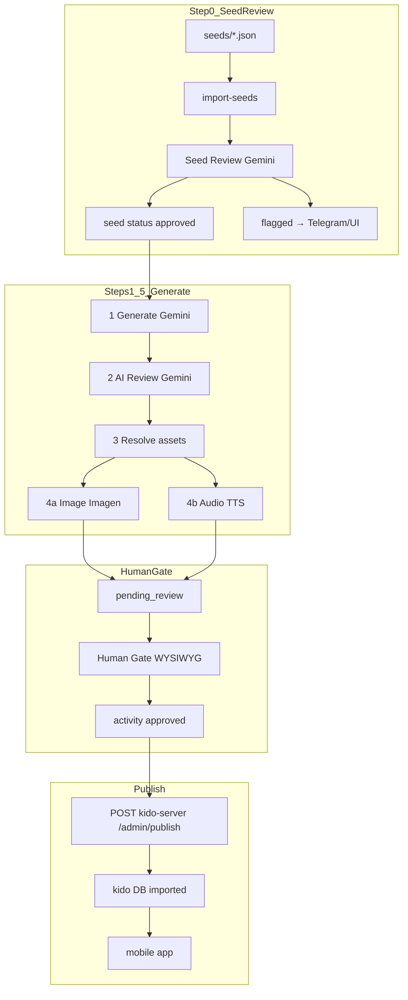

# Kido Pipeline — Tổng quan chi tiết

`kido-pipeline` là hệ thống **sản xuất nội dung học tập** cho app Kido (trẻ 4–6 tuổi): từ seed JSON → activity hoàn chỉnh (text, ảnh, audio) → human review → publish sang `kido-server` cho mobile app.

**Stack:** Next.js 14 admin UI + Bull/Redis workers + MongoDB + Vertex AI (Gemini, Imagen, TTS tiếng Anh) + VieNeu-TTS (tiếng Việt) + **Cloudflare R2** (media đã publish). Xem `docs/KIDO_MEDIA_STORAGE.md`.

---

## 1. Documentation (Doc)

### Nguồn tài liệu tham chiếu

| Nguồn | Vị trí | Nội dung |
|---|---|---|
| **KIDO_BACKLOG.md** | `docs/KIDO_BACKLOG.md` | User stories EPIC-012 (generate, review, assets, image, audio, import) |
| **OpenSpec publish flow** | `openspec/changes/archive/2026-07-01-content-publish-flow/` | Human Gate, publish sang kido-server, guard deterministic |
| **`.env.example`** | `kido-pipeline/.env.example` | GCP, Mongo, Redis, Telegram, tuning |
| **KIDO_CONTENT_PIPELINE.md** | `docs/KIDO_CONTENT_PIPELINE.md` | **Spec chính thức**: steps, status lifecycle, 18 review rules, seed-review rules, publish handoff |
| **File này** | `docs/KIDO_PIPELINE.md` | Tổng quan cấu trúc, flow, vận hành, handover |

> **Lưu ý:** Spec đầy đủ giờ nằm ở [`KIDO_CONTENT_PIPELINE.md`](./KIDO_CONTENT_PIPELINE.md) (tạo trong change `kido-pipeline-handover`). File này (`KIDO_PIPELINE.md`) là overview vận hành + handover.

---

## 2. Structure (Cấu trúc)

```
kido-pipeline/
├── app/                          # Next.js Admin UI (:3000)
│   ├── page.tsx                  # Dashboard tuần
│   ├── seeds/                    # Seed Review UI
│   ├── review/                   # Human Gate — activity review
│   ├── import/                   # Import tuần (legacy)
│   ├── published/                # Content đã publish
│   ├── api/                      # REST routes
│   └── components/               # ActivityCard, HumanGate, LessonPlayerWeb...
│
├── src/
│   ├── pipeline/
│   │   ├── steps/                # Step 1–5 (generate → import)
│   │   ├── seed-review/          # Step 0 — seed pedagogical review
│   │   ├── runner.ts             # Orchestrator sync hoặc enqueue
│   │   └── helpers.ts
│   ├── publish/                  # Build payload + POST kido-server
│   ├── queue/
│   │   ├── index.ts              # Bull queues
│   │   └── workers/              # generate, image, audio, seed-review
│   ├── db/models/                # Mongoose schemas
│   ├── types/                    # activity.types, seed.types
│   ├── prompts/                  # Gemini prompts
│   ├── services/                 # gemini, imagen, tts, storage, telegram
│   └── scripts/                  # CLI: import, pipeline, publish, seed-review...
│
├── seeds/                        # JSON seed files (384 seeds, Q1–Q2 toán)
├── deploy/                       # GCP VM deploy scripts
├── docker-compose.yml            # mongo + redis + admin + 4 workers
└── Dockerfile
```

### MongoDB collections (`kido_pipeline`)

| Collection | Mục đích |
|---|---|
| `seeds` | Seed gốc + `status` (review) + `pipelineStatus` (generate) |
| `activities` | Activity JSON sau generate |
| `assets_library` | Ảnh dùng chung (reuse) |
| `activity_assets` | Ảnh riêng từng activity |
| `pipeline_logs` | Log seed review |
| `telegram_sessions` | State edit flow Telegram |

### Bull queues (Redis)

| Queue | Worker |
|---|---|
| `generate` | `generate.worker` — steps 1–3 + enqueue media |
| `image` | `image.worker` — Imagen |
| `audio` | `audio.worker` — TTS |
| `seed-review` | `seed-review.worker` — Step 0 |

---

## 3. Flow (Luồng end-to-end)



### Chi tiết từng bước

#### Step 0 — Seed Review (offline, trước generate)

- **Import:** `npm run import-seeds` → seed mới có `status: pending_review`
- **Review:** Gemini + rule sư phạm theo `actionType` (sort_sequence, select, match_pair, count_tap)
- **Output:** `approved` / `flagged` / `rejected`
- **Human action:** Telegram hoặc Admin UI `/seeds`

#### Step 1 — Generate

- **Input:** seed `status === 'approved'` AND `pipelineStatus === 'pending'`
- Gemini tạo activity JSON từ `questionCore`

#### Step 2 — AI Review

- Gemini chấm activity (technical + pedagogical)
- Pass → tiếp tục; fail → Telegram alert + seed `pipelineStatus: error`

#### Step 3 — Assets

- Match `assets_library` hoặc tạo `activity_assets` mới

#### Step 4 — Media (async workers)

- **Image:** Imagen → staging cục bộ → **R2** lúc publish
- **Audio:** TTS → staging cục bộ (AAC-LC `.m4a`) → **R2** lúc publish (5 fields: question, correct, hint1, hint2, explain). `vi` đi VieNeu, `en` đi Gemini.

#### Step 5 — Human Gate (quality gate chính cho activity)

- Admin `/review/activity/{id}` — `LessonPlayerWeb` + production checklist
- Approve → `activity.status: approved`

#### Publish → kido-server

- Khi tuần đủ approved → `POST /admin/publish` (`KIDO_SERVER_URL`)
- Server upsert lesson + activity với `status: imported`
- Mobile app đọc từ `kido` DB

### Hai mode chạy pipeline

| Mode | Cách chạy | Đặc điểm |
|---|---|---|
| **Docker workers** | `docker compose up` | Generate async; image/audio workers riêng; dừng ở `pending_review` chờ human |
| **CLI sync** | `npm run pipeline:week -- --week 1` | `PipelineRunner` chạy steps 1–5 tuần tự trong 1 process |

---

## 4. Admin UI routes

| URL | Chức năng |
|---|---|
| `/` | Dashboard tuần (activity pipeline) |
| `/seeds` | Danh sách seed review + filter status/tuần |
| `/seeds/{seedId}` | Chi tiết flags, suggestion, human actions |
| `/review/w{week}/{day}` | List activities chờ human review |
| `/review/activity/{id}` | Human Gate WYSIWYG |
| `/import/w{week}` | Legacy import (đánh dấu imported) |
| `/published` | Content đã publish |

---

## 5. API routes

| Method | Route | Chức năng |
|---|---|---|
| POST | `/api/pipeline/seed-review` | Trigger seed review (single/week/full_audit) |
| POST | `/api/pipeline/seed-review/action` | Human action: use_suggestion, keep, reject, edit |
| POST | `/api/telegram/webhook` | Telegram callback + edit flow |
| POST | `/api/review/{activityId}/approve` | Approve activity |
| POST | `/api/review/{activityId}/reject` | Reject + re-queue generate |
| POST | `/api/publish/{week}` | Publish tuần → kido-server |
| POST | `/api/import/{week}` | Legacy import tuần |

> Generate **không có HTTP endpoint** — chạy qua worker hoặc CLI.

---

## 6. Scripts thường dùng

```bash
cd kido-pipeline

# Seed
npm run import-seeds              # Import JSON → MongoDB
npm run migrate:seed-review       # Migration fields seed review
npm run trigger:seed-review       # Chạy seed review (direct, không cần Redis)
npm run worker:seed-review        # Worker queue seed review
npm run test:seed-review          # Test manual (fixtures voi/lâu đài cát)

# Pipeline
npm run worker:generate           # Worker generate
npm run worker:image              # Worker image
npm run worker:audio              # Worker audio
npm run pipeline:week             # CLI sync 1 tuần (--week N --day D1)

# Publish & ops
npm run publish:week              # Publish tuần → kido-server
npm run daily-summary             # Telegram báo cáo ngày
npm run admin:dev                 # Admin UI local (:3000)

# Test
npm test                          # Vitest unit tests
```

### Kiểm tra seed review progress

```bash
npx ts-node src/scripts/check-seed-review-status.ts
```

Hoặc MongoDB:

```javascript
db.seeds.aggregate([{ $group: { _id: "$status", count: { $sum: 1 } } }])
db.pipeline_logs.find({ step: "seed_review" }).sort({ createdAt: -1 }).limit(10)
```

---

## 7. Seed data model

Seed có **hai trạng thái tách biệt**:

| Field | Values | Ý nghĩa |
|---|---|---|
| `status` | `pending_review`, `approved`, `flagged`, `edited`, `rejected` | Pedagogical review (Step 0) |
| `pipelineStatus` | `pending`, `processing`, `done`, `error` | Generate lifecycle |

Generate chỉ chạy khi: **`status === 'approved'`** AND **`pipelineStatus === 'pending'`**.

`seedReviewResult` chứa: `passed`, `flags[]`, `suggestion`, `reviewedAt`.

---

## 8. Docker Compose services

| Service | Port / Command |
|---|---|
| `mongo` | MongoDB 7, volume `mongo_data` |
| `redis` | Redis 7 |
| `admin` | Next.js `:3000` |
| `worker-generate` | Bull generate queue |
| `worker-image` | Bull image queue |
| `worker-audio` | Bull audio queue |
| `worker-seed-review` | Bull seed-review queue |

Deploy production: `deploy/deploy.sh` lên GCP VM.

---

## 9. Environment variables

Xem `kido-pipeline/.env.example`:

| Nhóm | Biến chính |
|---|---|
| GCP (Vertex) | `GCP_PROJECT`, `GCP_LOCATION` |
| GCP (legacy buckets — chỉ dùng cho `migrate:images-r2`) | `GCP_BUCKET_IMAGES`, `GCP_BUCKET_AUDIO` |
| Cloudflare R2 | `R2_ACCOUNT_ID`, `R2_ACCESS_KEY_ID`, `R2_SECRET_ACCESS_KEY`, `R2_BUCKET_IMAGES`, `R2_BUCKET_AUDIO`, `R2_PUBLIC_BASE_IMAGES`, `R2_PUBLIC_BASE_AUDIO` |
| Models | `GEMINI_MODEL`, `IMAGE_MODEL`, `TTS_MODEL`, `TTS_VOICE`, `TTS_VOICE_EN` |
| TTS tiếng Việt | `TTS_VI_PROVIDER`, `VIENEU_BASE_URL`, `VIENEU_VOICE`, `VIENEU_SAMPLE_RATE`, `VIENEU_CONCURRENCY`, `AUDIO_AAC_BITRATE` |
| DB | `MONGODB_URI` (default `kido_pipeline`) |
| Queue | `REDIS_URL` |
| Telegram | `TELEGRAM_BOT_TOKEN`, `TELEGRAM_CHAT_ID`, `TELEGRAM_WEBHOOK_SECRET` |
| Pipeline | `PIPELINE_BATCH_SIZE`, `PIPELINE_DELAY_MS`, `SEED_REVIEW_DELAY_MS` |
| Publish | `KIDO_SERVER_URL` (default `http://localhost:3001`) |
| Admin | `ADMIN_BASE_URL` |

---

## 10. Lưu ý quan trọng

### Kiến trúc & data

1. **Hai DB tách biệt:** `kido_pipeline` (authoring) vs `kido` (runtime). Publish là bước copy có guard — không edit trực tiếp trên server.

2. **Seed Review ≠ Activity Review:** Step 0 validate `questionCore` trước generate; Step 2 validate activity JSON sau generate.

3. **Human Gate là gate chính** cho activity (theo OpenSpec). AI review step 2 vẫn chạy nhưng chất lượng cuối do checklist human quyết định.

4. **Duplicate detection** thuộc Seed Review (rule `SEED_OBJECT_DIVERSITY`), không lặp lại ở Human Gate.

### Vận hành

5. **Redis bắt buộc** cho queue mode. Local không có Redis → dùng `npm run trigger:seed-review` (flag `--direct`).

6. **Gemini rate limit** — seed review chạy tuần tự ~5s/seed; full audit 384 seeds ~30+ phút; có thể crash `ECONNRESET` giữa chừng → chạy lại phần còn `pending_review`.

7. **Telegram webhook** cần HTTPS production + `TELEGRAM_WEBHOOK_SECRET`. Local dev có thể dùng UI `/seeds` thay Telegram.

8. **Chưa có GET job progress** cho seed review API — theo dõi qua MongoDB `pipeline_logs` hoặc UI `/seeds`.

9. **Imagen chậm + rate limit** — tune `IMAGEN_DELAY_MS`, `IMAGEN_MIN_INTERVAL_MS`.

### Gap spec vs code

10. **HTTP endpoints per-step trong backlog** (`POST /api/pipeline/generate|review|...`) **cố ý không implement** — pipeline chạy queue/CLI. Đây là lựa chọn kiến trúc, không phải gap. Xem [`KIDO_CONTENT_PIPELINE.md` §6](./KIDO_CONTENT_PIPELINE.md).

11. **Legacy local-import đã được retire** (change `kido-pipeline-handover`): `5-import.ts` đã xoá; CLI runner giờ kết ở **`pending_review`** (như worker), không còn auto-approve. `POST /api/import/[week]` trả 410; trang `/import/w{week}` chỉ dẫn sang publish. `imported` giờ **chỉ** nghĩa là đã publish sang kido-server.

12. **Caveat activity legacy:** activity đã `approved`/`imported` từ CLI auto-approve **cũ** chưa hề qua Human Gate → cần re-verify qua gate trước khi publish. Không có migration tự động.

13. **Web `LessonPlayerWeb`** có thể drift so với mobile player — cần review fidelity per action type.

---

## 11. Quan hệ với các repo khác

```
seeds/*.json
    ↓
kido-pipeline (authoring, MongoDB kido_pipeline, media → Cloudflare R2)
    ↓ publish (POST /admin/publish)
kido-server (NestJS, MongoDB kido, API lessons)
    ↓
mobile (Expo RN, Lesson Player)
```

---

## 12. Seed files hiện có

| File | Phạm vi |
|---|---|
| `KIDO_MATH_SEEDS_Q1_W01-04.json` | Q1 tuần 1–4 |
| `KIDO_MATH_SEEDS_Q1_W05-08.json` | Q1 tuần 5–8 |
| `KIDO_MATH_SEEDS_Q1_W09-12.json` | Q1 tuần 9–12 |
| `KIDO_MATH_SEEDS_Q2_W13-16.json` | Q2 tuần 13–16 |
| `KIDO_MATH_SEEDS_Q2_W17-20.json` | Q2 tuần 17–20 |
| `KIDO_MATH_SEEDS_Q2_W21-24.json` | Q2 tuần 21–24 |
| `test-fixtures.json` | Fixtures test seed review |

Tổng ~384 seeds (toán, D1/D4, actionType: sort_sequence, single_select, multi_select, match_pair, count_tap).

---

## 13. Handover — EPIC-012 ↔ code

Spec chính thức đầy đủ: **[`KIDO_CONTENT_PIPELINE.md`](./KIDO_CONTENT_PIPELINE.md)** (steps, status lifecycle, 18 review rules, seed-review rules, publish handoff). File này là bản overview vận hành.

| Story | Backlog | Trong code | Trạng thái |
|---|---|---|---|
| 012-01 Generate | `POST /api/pipeline/generate` | `steps/1-generate.ts` (worker/CLI) | ✅ chức năng — không HTTP endpoint (cố ý) |
| 012-02 AI Review (18 rules) | `POST /api/pipeline/review` | `steps/2-review.ts` + `prompts/review.prompt.ts` | ✅ inline |
| 012-03 Assets | `POST /api/pipeline/assets/find-or-create` | `steps/3-assets.ts` | ✅ inline |
| 012-04 Image (Imagen) | `POST /api/pipeline/generate-image` | `steps/4-image.ts` + `image.worker` | ✅ |
| 012-05 Audio (TTS) | `POST /api/pipeline/generate-audio` | `steps/4-audio.ts` + `audio.worker` | ✅ |
| 012-06 Week Import | `POST /api/pipeline/import` | Publish flow (`src/publish/` → kido-server); legacy local-import **retired** | ✅ (đã hội tụ 1 đường) |
| 012-07 Hot-fix | `PATCH /api/pipeline/fix-activity` | `scripts/hotfix.ts` (re-flow gate) | ✅ CLI |

### Handover runbook

```bash
# 1. Seed → review
npm run import-seeds
npm run trigger:seed-review        # không cần Redis (--direct)

# 2. Generate → pending_review (chọn 1 mode)
docker compose up                  # workers async
npm run pipeline:week -- --week 1  # CLI sync (giờ cũng dừng ở pending_review)

# 3. Human Gate: /review/w01/d1 → duyệt từng activity
# 4. Publish cả tuần khi đủ approved
npm run publish:week -- 1          # → POST {KIDO_SERVER_URL}/admin/publish
```

**Monitor:** `db.seeds.aggregate([{ $group: { _id: "$status", count: { $sum: 1 } } }])` · `pipeline_logs` · UI `/seeds`, `/review/w{week}/d1`, `/published`.

**Troubleshoot:** Redis down → `--direct`; Gemini/Imagen `ECONNRESET`/rate-limit → chạy lại phần `pending_review`, tune `IMAGEN_DELAY_MS` / `IMAGEN_MIN_INTERVAL_MS`.

**⚠️ Caveat:** activity `approved`/`imported` từ CLI auto-approve **cũ** chưa qua Human Gate — re-verify trước khi publish (xem §10.12).

---

*Cập nhật: 2026-07-01 — change `kido-pipeline-handover`: CLI hội tụ về Human Gate, retire legacy import, thêm `KIDO_CONTENT_PIPELINE.md`.*
